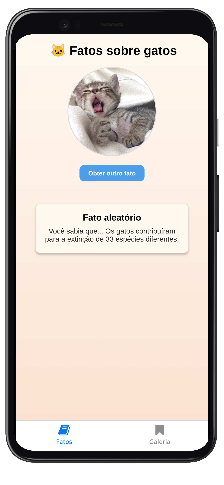

# Curiosidades sobre gatos

## Descrição do Projeto
Este projeto tem como objetivo implementar uma aplicação que utiliza um sistema de navegação, utilizando tecnologias modernas e boas práticas de desenvolvimento. Ele foi desenvolvido como parte de uma atividade prática da matéria de Computação para Dispositivos Móveis 5º período de Sistemas da Informação.

## Funcionalidades
- [x] Fatos aleatórios sobre gatos
- [x] navegação entre rotas.
- [x] Interface amigável e responsiva.
- [x] Integração com APIs externas para dados.
- [x] Armazenamento local para dados descobertos.

## Tecnologias Utilizadas
- **Linguagem de Programação:** [Typescript](https://www.typescriptlang.org/)
- **Frameworks:** [React Native](https://reactnative.dev/), [Expo](https://expo.dev/)
- **APIs:** [MeowFacts](https://meowfacts.herokuapp.com/), [Cataas](https://cataas.com)

## Como Executar o Projeto
1. Clone o repositório:
    ```bash
    git clone https://github.com/PHCavalcante/curiosidades-sobre-gatos.git
    ```
2. Acesse o diretório do projeto:
    ```bash
    cd curiosidades-sobre-gatos
    ```
3. Instale as dependências:
    ```bash
    npm install
    ```
4. Inicie a aplicação:
    ```bash
    npm start
    ```
5. Acesse a aplicação no navegador em `http://localhost:8081`.

## Estrutura do Projeto
```
curiosidades-sobre-gatos/
├── app/
│   ├── (tabs)/
├── assets/
├── components/
├── package.json
└── README.md
```

## Screenshots





## Licença
Este projeto está licenciado sob a [Licença MIT](LICENSE).